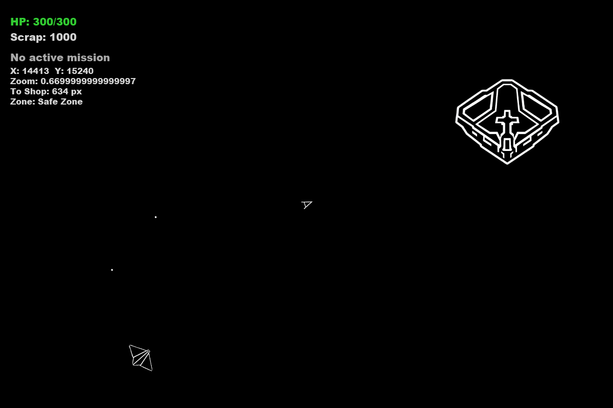

# Asteroids: RPG

> Двухмерная космическая RPG с открытым миром, боями, торговлей и охотой за головами.

Asteroids: RPG — это десктопная игра, превращающая классическую аркаду в ролевое приключение.  




## Стек технологий

| Компонент | Назначение |
|-----------|------------|
| [Java](https://www.java.com/) 22 | Язык программирования |
| [JavaFX](https://openjfx.io/) | Графический фреймворк для GUI и рендеринга |
| [JDBC](https://docs.oracle.com/javase/8/docs/technotes/guides/jdbc/) | Взаимодействие с базой данных |

## Возможности

- **Два типа врагов** (скаут и танк) с разным поведением: патруль, страж, бродячий
- **Система миссий**:
    - Уничтожение врагов, сбор ресурсов, разрушение астероидов
    - **Охота за головами (Bounty)** — уникальные цели с именем, усиленными характеристиками и таймером
- **Экономика**: три вида ресурсов (scrap, energy cells, alloy), торговля на станции и улучшения на заводе
- **Плавное управление кораблём** с инерцией, ускорением и торможением
- **Интерактивные интерфейсы**:
    - Магазин (`E` у станции)
    - Завод улучшений (`E` у завода)
    - Доска миссий (внутри станции)
    - Экран характеристик корабля (`F4`)
- **Отладочная информация** по клавишам `F1`/`F2`/`Tab` (координаты, зоны, прогресс миссий)
- **Камера** с плавным зумом (`+`/`-`) и сбросом (`0`)

## Требования

- **Операционная система**: Windows, macOS, Linux
- **Java Development Kit (JDK)**: 22 или выше
- **JavaFX SDK**: 22.0.1 (рекомендуется)

## Установка и запуск

### 1. Клонирование репозитория

```bash
git clone https://github.com/Namonga/java-Asteroids-rpg.git
```

Структура проекта:
```
asteroids-black-horizon/
├── src/
│   └── org/com/gamep/
│       ├── AsteroidsApp.java             # Точка входа, инициализация базы и меню
│       ├── Camera.java                   # Камера с зумом
│       ├── GameConfig.java               # Все константы и настройки
│       ├── Rectangle.java                # Прямоугольная область для коллизий
│       ├── ScoreDatabase.java            # База данных SQLite (рекорды)
│       ├── Vector.java                   # 2D-вектор (позиция/скорость)
│       ├── game/
│       │   ├── GameEngine.java           # Главный движок: логика, враги, миссии
│       │   ├── InputHandler.java         # Обработчик клавиатуры
│       │   ├── Mission.java              # Миссия (обычная и bounty)
│       │   └── Zone.java                 # Зона мира (тип, центр, радиус)
│       ├── sprites/
│       │   ├── Sprite.java               # Базовый класс всех визуальных объектов
│       │   ├── Spaceship.java            # Корабль игрока
│       │   ├── Asteroid.java             # Астероид (большой/малый)
│       │   ├── Enemy.java                # Враг (скаут/танк, ИИ, поведение)
│       │   ├── Laser.java                # Лазерный выстрел
│       │   ├── Debris.java               # Обломки разрушения (включая вражеские)
│       │   ├── Loot.java                 # Собираемый ресурс (scrap/cell/alloy)
│       │   ├── Station.java              # Станция (магазин)
│       │   ├── Factory.java              # Завод (улучшения)
│       │   └── Planet.java               # Планета (задний план)
│       └── ui/
│           ├── GameView.java             # Основной игровой экран (Canvas, рендер, UI)
│           ├── ShopView.java             # Интерфейс магазина
│           ├── FactoryView.java          # Интерфейс завода
│           ├── MissionBoardView.java     # Доска миссий
│           ├── StatsView.java            # Характеристики корабля + ресурсы
│           ├── MainMenuView.java         # Главное меню
│           ├── GameOverView.java         # Экран завершения игры
│           ├── LeaderboardView.java      # Таблица рекордов
│           └── SettingsView.java         # Настройки сложности
├── resources/
│   ├── spaceship_32x23.png
│   ├── ...
│   └── new/                              # Основные игровые ассеты (ч/б векторный стиль)
│       └── ...            # Imgs для игры
└── README.md
```

## Архитектура

Игра построена по паттерну Model-View-Controller (MVC).

    1.Model – GameEngine и спрайты (Sprites). Хранит состояние мира, списки объектов, ресурсы, миссии. Обрабатывает физику, коллизии, спавн, прогресс миссий.
    2.View – GameView и UI-классы (ShopView, FactoryView, …). GameView содержит Canvas, на котором каждый кадр отрисовываются все объекты с учётом камеры и зума. Интерфейсы (меню, магазин) создаются как JavaFX-контейнеры и накладываются поверх холста.
    3.Controller – GameView также выступает контроллером: принимает ввод от InputHandler и передаёт в GameEngine.processInput(). Управляет паузой, открытием/закрытием интерфейсов.

Игровой цикл:

    1.InputHandler собирает нажатия.
    2.GameView передаёт их в GameEngine.
    3.GameEngine.update(deltaTime) обновляет все объекты, ИИ, спавн.
    4.GameView.render() рисует мир и UI.

Торговля и улучшения взаимодействуют с GameEngine напрямую через методы spendScrap, addAlloy и т.п.
## Конфигурация

Все ключевые параметры вынесены в класс GameConfig:
java

    public static final int WORLD_WIDTH = 30000;
    public static final double SPACESHIP_ACCELERATION = 30.0;
    public static final int INITIAL_ASTEROID_COUNT = 500;
    public static final int BOUNTY_REWARD_SCRAP = 50;
    // … идт

Изменив их, можно быстро настроить баланс, размеры мира, поведение врагов и награды без правки игровой логики.